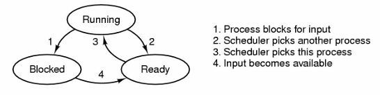

# Homework 3

Ishan Pranav

October 16, 2024

Professor Yang Tang

CSCI 202 Operating Systems

## Question 1

> Alice has learned that the function `strncpy` can be used to copy a string. So
> she writes the following code to try it out. However, the result isn’t what
> she expects.

```c
#include <stdio.h>
#include <string.h>

int main()
{
    char str1[4] = "1234";
    char str2[4];

    strncpy(str2, str1, sizeof(str2));
    printf("str2 = %s\n", str2);
}
```

> Can you explain this issue to Alice and help her correct it?

The `strncpy` function copies a fixed-length string, returning a pointer to the
end of the string. The call to `strncpy` function writes at most `sizeof(str2)`
bytes to the output buffer `str2`, followed by at least one `NUL` terminator
(`\0`). However, since `sizeof(str2)` is 4, the `str2` buffer is not large
enough to contain the 5 characters written. The result is a buffer overflow,
which is undefined behavior. To fix this issue, Alice can increase the size of
`str2` to at least 5 and pass the literal value `4` as the size, rather than
`sizeof(str2)` as the argument to `strncpy`.

## Question 2

> Now, Alice wants to see if `strncpy` can be used to copy other types of
> arrays. So she writes the following code. Since `strncpy` only accepts `char*`
> arguments, she uses a trick: She casts the integer arrays to `char*` type.

```c
#include <stdio.h> 
#include <string.h> 

int main() 
{ 
    int arr1[4] = { 1, 2, 3, 4 };
    int arr2[4];

    strncpy((char*)arr2, (char*)arr1, sizeof(arr2));

    printf("arr2 = ");

    for (int i = 0; i < 4; ++i)
    {
        printf("%d", arr2[i]);
    }

    printf("\n");
}
```

> Once again, this code does not work: only the first element of `arr1` is
> copied to `arr2`.

### Question 2 Part 1

> Can you explain to Alice what’s happening here?

The `strncpy` function copies *bytes*, not necessarily values. This call to
`strncpy` passes `arr2` as a pointer to a zero-terminated byte string.

Since Alice notices that only the first byte is copied, we can assume something
about the endianness of the machine. On this machine, the first byte of `arr1`
is `0x01`, followed by `0x00`, `0x00`, and `0x00` (since the first element is
`1`). This means that the byte `0x01` is copied to `arr2`, then a zero is
encountered, so the copying stops after the first `0x00`. Then, `strncpy`
initializes the remainder of `arr2` with zero bytes.

The result is that `arr2` contains the values `{ 1, 0, 0, 0 }`.

### Question 2 Part 2

> Instead of `strncpy`, what function should be used to copy an array?

Instead of `strncpy`, Alice can use `memcpy`, which does not stop copying when a
zero is encountered.

## Question 3

> When an interrupt or a system call transfers control to the operating system,
> a kernel stack area separate from the stack of the interrupted process is
> generally used. Why?

When an interrupt or system call transfers control to the operating system, a
separate kernal stack area is used to protect the state of user-space programs.

If the state were not kept separate, then user-space programs may become
corrupted. Keeping a separate kernal-space stack preserves the illusion that the
user-space applications have control over the computer's memory.

## Question 4

> In the following figure, three process states are shown.



> In theory, with three states, there could be six transitions, two out of each
> state. However, only four transitions are shown. Are there any circumstances
> in which either or both of the missing transitions might occur?

In theory, with three states, there could be six transitions. However, the
blocked-to-running and ready-to-blocked states are missing.

Blocked-to-running may not occur, because the process cannot begin running until
it is started by the scheduler. Similarly, ready-to-blocked is impossible since
a process that has not yet been started cannot be blocked.

## References

- Linux manual pages
  - [strncpy(3p) - copy fixed length string](https://www.man7.org/linux/man-pages/man3/strncpy.3p.html)
