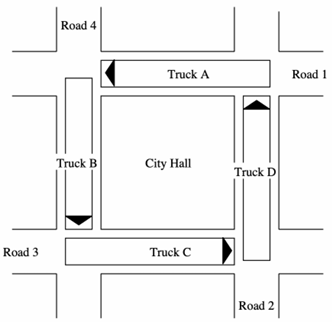
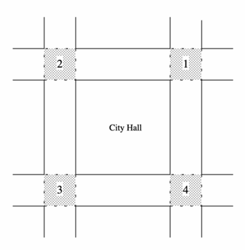
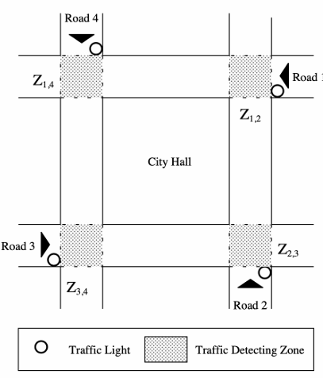

# Homework 5

Ishan Pranav

November 13, 2024

Professor Yang Tang

CSCI 202 Operating Systems

## Question 1

> Alice tries to pass an argument from the main thread to the child thread.

```c
#include <pthread.h> 
#include <stdio.h>

void *run(void *arg) 
{
  printf("child: %d\n", *((int *)arg));
  
  *((int *)arg) = 2;

  printf("child: %d\n", *((int *)arg));
  pthread_exit(NULL);
}

int main()
{
    pthread_t tid;
    int arg = 1;

    printf("main: %d\n", arg);
    pthread_create(&tid, NULL, run, &arg);
    pthread_join(tid, NULL);
    printf("main: %d\n", arg);
}
```

### Question 1 Part 1

> What’s the output of this program?

```sh
main: 1
child: 1
child: 2
main: 2
```

### Question 1 Part 2

> Alice thinks that each thread should have a separate stack. However, changing
> `arg` in the child thread also changes the value in the main thread. What’s
> the error in Alice’s reasoning?

Alice is correct that each thread has a separate stack. However, `arg` is stored
on the main thread's stack, and a pointer to `arg` is passed as an argument to
each thread. As a result, modifying `arg` via the pointer will modify the value
stored on the main thread's stack, which is a shared resource in this case.

## Question 2

> In order to avoid accessing the stack of the main thread, Alice decides to
> make a copy of `arg`’s value in the child thread.

```c
#include <pthread.h>
#include <stdio.h>

void *run(void *arg)
{ 
    int index = *((int*)arg);

    printf("My index is %d\n", index);
    pthread_exit(NULL);
} 

int main()
{
    pthread_t tid[5];                           // (a)
    
    for (int i = 0; i < 5; ++i)
    {
        pthread_create(&tid[i], NULL, run, &i); // (b)
    }
    
    for (int i = 0; i < 5; ++i)
    {
        pthread_join(tid[i], NULL);
    }
}
```

> Is there any problem with this code? If so, can you help Alice correct it?

Yes, the issue is that a pointer to a temporary value `i` is passed as an
argument to each child thread. However, copying `i` via the `arg` pointer may
occur out of order. This means that `i` may have changed by the time a child
thread executes.

We can solve this problem by storing the index for each thread in its own
memory location.

Insert after line (a):

```c
    int index[5];
```

Replace line (b):

```c
        index[i] = i;

        pthread_create(&tid[i], NULL, run, &index[i]);
```

## Question 3

> Alice and Bob each have an account in a bank. Bob wants to transfer money to
> Alice.

```c
#include <pthread.h>

double alice_balance, bob_balance;

static pthread_mutex_t mutex = PTHREAD_MUTEX_INITIALIZER;

void transfer_bob_to_alice(double trans)
{ 
    if (bob_balance < trans)    // line (a)
    { 
        return; 
    }

    pthread_mutex_lock(&mutex); // line (b)

    bob_balance -= trans; 
    alice_balance += trans; 

    pthread_mutex_unlock(&mutex); 
}
```

> Unfortunately, the implementation of the function `transfer_bob_to_alice` is incorrect

### Question 3 Part 1

> What’s wrong?

The implementation of `transfer_bob_to_alice` contains a race condition. It
reads `bob_balance` without acquiring a lock. It is possible that two threads
concurrently execute `transfer_bob_to_alice` and make a transfer, even if Bob's
balance is only sufficient for one such transfer.

The first thread checks to confirm that Bob's balance is sufficient before
making a transfer. Then, a thread context-switch occurs and the second thread,
makes the same assertion. Suppose the first thread acquires the lock first and
completes the transfer. Then, the second thread acquires the lock and makes
another transfer. Both transfers succeed, even if the first transfer made Bob's
balance insufficient for the second.

> State the fix in one sentence.

We need to acquire a lock before checking Bob's balance; that is, we should move
line (b) before line (a).

## Question 4

> In the city of Old Essex, there are four one-way roads, namely **Road 1**,
> **Road 2**, **Road 3**, and **Road 4**, around the City Hall.
> One day, four foreign, oversized trucks arrived in the city. Unfortunately,
> their arrival caused unexpected traffic congestion. You, a police officer,
> observed this scenario and drew the picture below.






